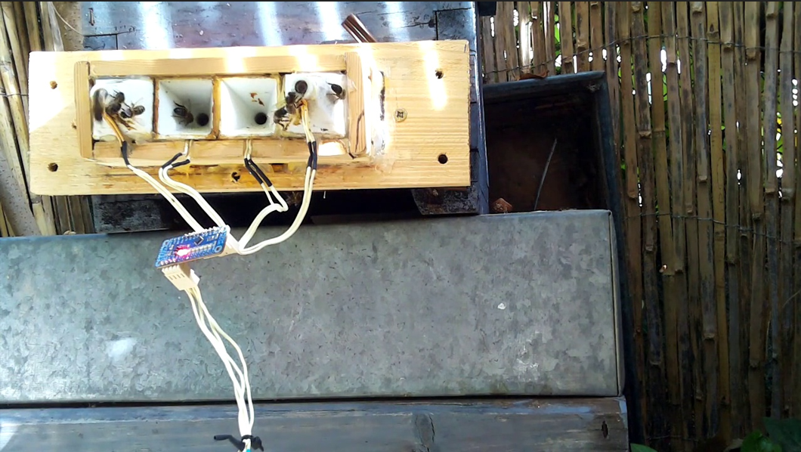
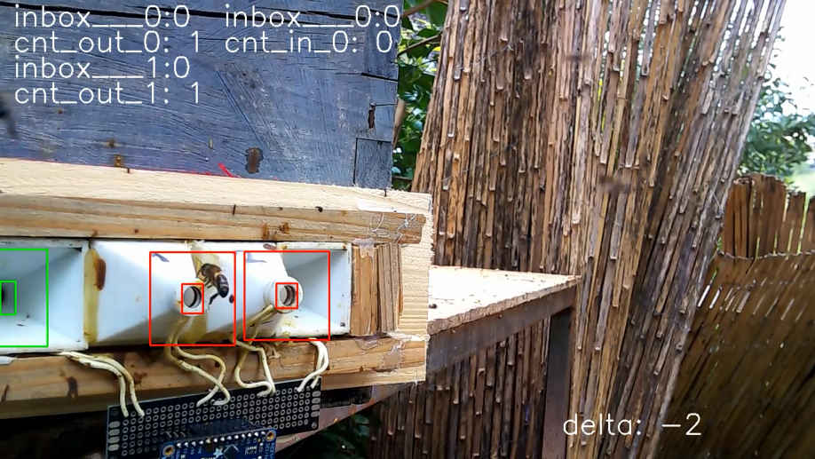

# Bee population monitor (video part)

## Description
The aim of this project is to analyze beehive entrances to monitor the population of a bee colony. 
Based on video camera signals and entry gate signals, we use two different approaches to estimate the population as accurately and universally as possible.
 
For image processing we have used an Ultralytics YOLOv8 object model with tracking.

## Usage
To use the graphic count you have to run the main file with desired movie and select entrances and exits as rectangles.
The algorithm will return a movie with a counter and save it.
 
<table>
  <tr>
    <th style="text-align:center">Example movie frame</th>
    <th style="text-align:center">Example counted movie frame</th>
  </tr>
  <tr>
    <td></td>
    <td></td>
  </tr>
</table>

<!-- Can add a license here -->

## Acknowledgements
* We are using train and test data from [here](https://github.com/atauri/splendidBC/tree/main/02_testingSw).
* Our used [model](https://docs.ultralytics.com/datasets/obb/).
* [Datasets](https://drive.google.com/file/d/1R3MvA9R4y3U3-nHWMdMNHXGH58sKyvjJ/view?usp=drive_link).

### Project team
- [Arivaldi](https://github.com/ar1valdi)
- [Montaso](https://github.com/Montaso)
- [Nurekk2003](https://github.com/NUREKK2003)
- [Mivekk](https://github.com/Mivekk)
- [Misphe](https://github.com/Misphe)

